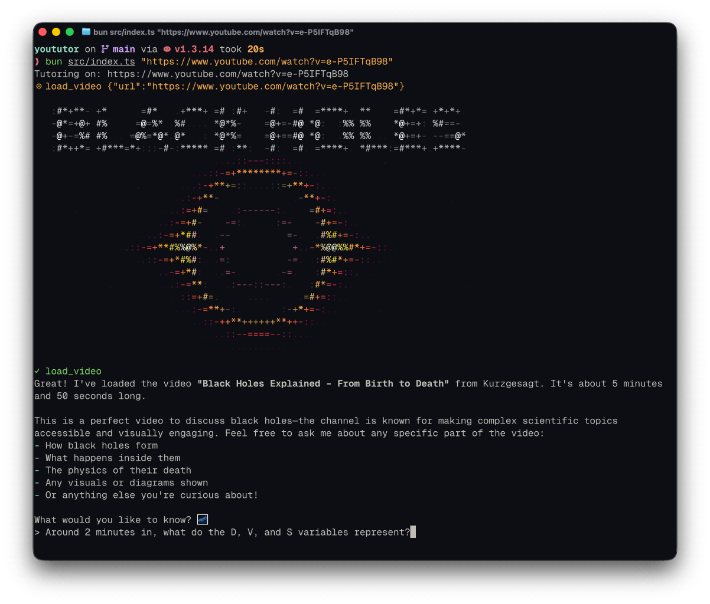

# YouTutor



A command-line tutor for YouTube videos. Give it a video URL, then ask questions about specific moments (*"at 4:30 they mention a 'commit graph', what does that look like?"*) and it answers using both the transcript around that timestamp and the actual video frames from that point.

It's built as an agentic harness: rather than running a fixed pipeline, the model decides which tools to call for each question. For a purely verbal question ("what did they say about X at 0:45?"), the model can pull from the transcript. For a question about something on screen ("what does the diagram at 2:05 mean?"), the model may ask to download frames from the video around the specified timestamp.

The terminal UI (built with [Ink](https://github.com/vadimdemedes/ink)) streams answers as rendered markdown, shows a spinner while tools run, and greets each loaded video with a color ASCII rendering of its thumbnail.

## Quick start

You'll need [Bun](https://bun.sh), plus `yt-dlp` and `ffmpeg` on your `PATH` (e.g. `brew install yt-dlp ffmpeg`), and an Anthropic API key.

```sh
bun install
echo 'ANTHROPIC_API_KEY=sk-ant-...' > .env   # Bun loads .env automatically
bun src/index.ts "https://www.youtube.com/watch?v=..."
```

Then ask questions referencing timestamps as you watch; pasting a different link mid-session switches videos. Type `/exit` to quit.

Both arguments are optional and can go in either order:

- `<youtube-url>`: the video to tutor on. When given, the harness loads it before your first prompt by **fabricating the opening exchange**: it scripts a synthetic user message and a synthetic `load_video` tool call into the conversation, then runs the tool for real. Without a URL, the session starts videoless; paste a link into the chat and the model loads it itself.
- `--console`: swap the Ink UI for a bare stdin/stdout loop (same agent underneath; see [Architecture](#architecture)).

The model is set in `src/agent/agent.ts`. It defaults to Haiku, which is plenty for grounded Q&A and keeps costs low. Configurable model coming soon.

## Tools

The model drives these through a standard agent loop. A single question might take several trips through the loop (transcript -> frames -> answer), with the model choosing what it needs at each step. Timestamps use clock format: `mm:ss` or `h:mm:ss`, optionally with fractional seconds (e.g. `0:45.2`).

| Tool | What it does |
| --- | --- |
| `load_video(url)` | Fetches the video's captions plus its metadata (title, description) into a shared, cached store via `yt-dlp`. Returns only orientation (title, description, covered time span), *not* the transcript itself. |
| `get_transcript_range(start_timestamp, end_timestamp)` | Returns the transcript text between two timestamps, sliced from the cached transcript. This is how transcript text actually enters the conversation. The model picks the bounds, so it controls the span; it can widen it for more context, or ask for an asymmetric window like the run-up to a moment. |
| `get_frames(timestamps)` | Extracts a frame at each requested timestamp and returns them as images for the model to look at. The model picks the exact timestamps, so it controls granularity: spread out to track change over time, or clustered on one moment. Under the hood, ffmpeg seeks into a stream URL with HTTP range requests, so no full video is ever downloaded. |

Transcripts come from the video's existing captions (manual or YouTube's automatic ones) via `yt-dlp`. They're instant downloaded as part of the `load_video` tool call, so there's no separate transcription step.

A failing tool returns a plain-English error string instead of throwing, so a bad URL or a missing caption track becomes something the model can read and react to.

## Design: the model manages its own context

The central idea is that **the agent controls its own context intake instead of being handed everything up front.**

`load_video` downloads and caches the transcript, but deliberately *withholds* it from the model, returning only metadata. The model then pulls exactly what each question needs: a transcript slice via `get_transcript_range`, frames via `get_frames`, choosing its own bounds and granularity.

Why: a 3-hour lecture is roughly 100k tokens of transcript. Front-loading it burns budget and dilutes the model's attention, and is unnecessary for questions like "explain the diagram at 45:00". On-demand loading keeps the working context to the part that actually matters.

The tradeoff is chosen deliberately, and it has known soft spots:

- **Global synthesis** ("summarize the whole lecture") degrades to the naive approach: the model can answer by pulling the entire range, but then the full transcript re-enters context anyway. In the future, I may add an LLM-generated timestamped summary to the `load_video` metadata to alleviate this, and to give the model guidance on where to look for non-timestamped questions.
- **Silent recall miss**: on a local question the model picks a window, the content isn't in it, and it answers anyway. In the future, I may add a `search_transcript` tool (keyword + embedding) to let the model find content it can't pin down by timestamp.

## Architecture

The design goal is a clean separation between the **agent loop** (talk to the model, run tools) and the **interface** (how the human sees output and provides input). The loop knows nothing about the UI; it imports neither `readline` nor `ink`.

This works through two ports:

- **Output**: the loop is an async generator that `yield`s semantic events (`textDelta`, `modelResponded`, `toolRunStarted`, `toolRunFinished`). The interface consumes them with a `for await` and renders however it likes.
- **Input**: when the loop needs the next user turn, it `await`s a method on an injected `Host` port. The host owns *displaying* the prompt as well as returning the answer, so the loop stays unaware of how input is gathered.

```ts
for await (const event of new Agent(host, createToolRegistry(), videoUrl).run()) {
	renderer.handle(event);   // console: write to stdout; Ink: push into React state
}
```

Capabilities (`load_video` / `get_transcript_range` / `get_frames`) live behind a third port: `ToolRegistry`.

This design allows the Ink UI and the bare console interface to be swapped into the same loop, switched with a CLI flag without any changes to the core agent logic. I did this because I started this project before I'd learned Ink, and I wanted to focus purely on the agent loop before polishing the UI.

One detail of the event design: a tool result can carry a separate `display` artifact (such as ASCII thumbnail art) alongside the text result. The renderer prints the artifact, but the model only ever sees the text, so the artifact costs zero tokens.

## Tech stack

- **TypeScript on Bun**: runtime, test runner, and shell-outs (`Bun.$`)
- **Anthropic SDK**: the model behind the loop, streaming responses
- **Zod**: tool input schemas, single source of truth (JSON Schema for the API, validation at runtime)
- **Ink + React**: terminal UI; **markdansi** renders the model's markdown to ANSI
- **yt-dlp / ffmpeg**: caption download and frame extraction

## Development

```sh
bun test            # 98 tests: pure logic (SRT parsing, timestamps, range slicing),
                    # tool contracts against a mocked store, and Ink rendering
bun run typecheck   # tsc --noEmit
bun run lint        # Biome
bun run dev         # watch mode
```
